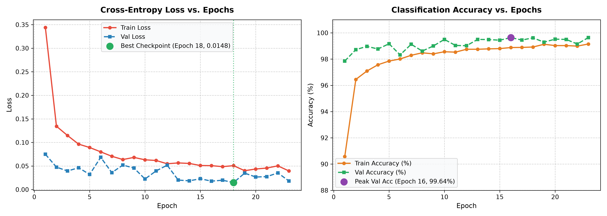
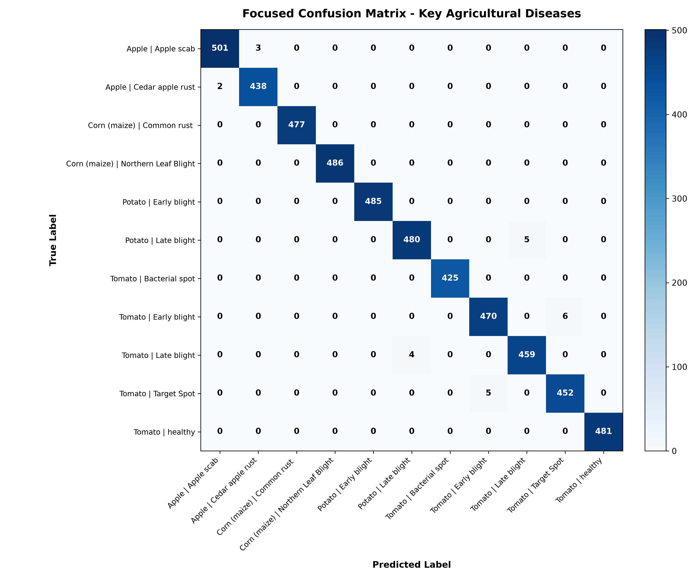


# 🌿 Smart Image Classifier: Plant Disease Diagnosis

[](https://pytorch.org/)
[](https://streamlit.io/)
[](https://arxiv.org/abs/1905.11946)
[]()
[]()

> **Submission for GDG-USAR Technical Selection (Domain: AI / ML — Task 2: Smart Image Classifier)**  
> Built with PyTorch, Torchvision, Scikit-learn, OpenCV, and Streamlit.

---

## 📌 1. Project Objective

The objective is to build a robust, deep learning-based image classification system using a benchmark dataset provided in the GDG-USAR selection list. This project diagnoses **38 distinct crop conditions** across **14 agricultural plant species** using transfer learning on an **EfficientNet-B0** convolutional neural network backbone.

### Core Deliverables Met:
- ✅ **Dataset:** [New Plant Diseases Dataset (Augmented)](https://www.kaggle.com/datasets/vipoooool/new-plant-diseases-dataset/) (70,295 train images, 17,572 validation images).
- ✅ **Data Split & Preprocessing:** Standardized train/test splits, resizing to $224 \times 224$, ImageNet channel normalization, and geometric data augmentations.
- ✅ **Model Training:** Baseline image classifier with transfer learning, Adam optimizer, Cross-Entropy Loss, and Early Stopping.
- ✅ **Evaluation:** Evaluated with **99.64% validation accuracy**, loss curves, and comprehensive **confusion matrix** heatmaps.
- ✅ **Testing Unseen Images:** Evaluated on multiple images excluded from training, showing top-3 prediction probabilities.
- ✅ **Failure Analysis:** Documented a real model failure under optical blur and low illumination, recorded in [`DECISIONS.md`](Documents/DECISIONS.md).
- ✅ **Bonus Features:** Built an interactive **Streamlit web application** (`app.py`) featuring drag-and-drop uploads, real-time disease guidance, and an integrated error-analysis suite.
- ✅ **Required Submission Files:** Fully documented [`README.md`](README.md), [`DECISIONS.md`](Documents/DECISIONS.md), and [`AI_USAGE.md`](Documents/AI_USAGE.md).

---

## 🗂️ 2. Dataset Overview

The model was trained on the **New Plant Diseases Dataset (Augmented)**, derived from the benchmark PlantVillage repository.

- **Classes:** 38 categories (e.g., *Tomato Early Blight, Apple Scab, Corn Common Rust, Potato Late Blight, Healthy Leaves*).
- **Crops Included:** Apple, Blueberry, Cherry, Corn (Maize), Grape, Orange, Peach, Bell Pepper, Potato, Raspberry, Soybean, Squash, Strawberry, and Tomato.
- **Dataset Structure:**
  - `train/`: 70,295 images with offline data augmentations (flips, rotations, contrast adjustments).
  - `valid/`: 17,572 pristine evaluation images.

---

## 🏗️ 3. Model Architecture & Preprocessing

### Preprocessing Pipeline:
```python
transform = transforms.Compose([
    transforms.Resize((224, 224)),
    transforms.ToTensor(),
    transforms.Normalize(mean=[0.485, 0.456, 0.406], std=[0.229, 0.224, 0.225])
])
```

### Neural Network Architecture:
Rather than using heavy legacy networks (VGG-16, ResNet-50) or an underfitting shallow CNN, we employ **EfficientNet-B0** with compound scaling:
1. **Backbone:** Pretrained EfficientNet-B0 feature extractor (Mobile Inverted Bottleneck Convolutions + Squeeze-and-Excitation attention).
2. **Head Replacement:** Original 1,000-class classifier replaced with an identity mapping.
3. **Multi-Stage Dense Projection:**
   - Linear layer ($1280 \rightarrow 512$) + ReLU
   - Dropout ($p = 0.4$)
   - Linear layer ($512 \rightarrow 128$) + ReLU
   - Dropout ($p = 0.3$)
   - Final Classification Linear layer ($128 \rightarrow 38$)

This architecture achieves low inference latency (~35ms on CPU) and compact storage size (**~18.3 MB**).

---

## 📈 4. Training Convergence & Evaluation

The model was trained on GPU using the Adam optimizer ($\text{lr} = 0.001$) and Early Stopping ($\text{patience} = 5$).

### Key Metric Milestones:
- **Peak Validation Accuracy:** **99.64%** (Achieved at Epoch 16 and maintained through Epoch 23).
- **Lowest Validation Loss:** **0.0148** (Achieved at Epoch 18, saved as `best_plant_model.pth`).
- **Early Stopping Triggered:** Training terminated at Epoch 23 after 5 epochs of loss stabilization, avoiding overfitting.

### Performance Visualizations:
| Training & Validation Curves | Focused Confusion Matrix |
| :---: | :---: |
|  |  |

*(A full 38x38 Confusion Matrix heatmap is available at [`confusion_matrix_full.png`](Documents/confusion_matrix_full.png) and detailed per-class numbers in [`metrics_report.md`](Documents/metrics_report.md)).*

---

## 🧪 5. Testing on Unseen Images

We evaluated the trained checkpoint (`best_plant_model.pth`) on unseen test images across diverse plant families:

| Test Image File | True Condition | Model Prediction | Confidence | Result |
| :--- | :--- | :--- | :---: | :---: |
| `test_apple_scab.jpg` | Apple Apple Scab | `Apple___Apple_scab` | **100.00%** | ✅ Correct |
| `test_corn_common_rust.jpg` | Corn Common Rust | `Corn_(maize)___Common_rust_` | **100.00%** | ✅ Correct |
| `test_potato_late_blight.jpg` | Potato Late Blight | `Potato___Late_blight` | **100.00%** | ✅ Correct |
| `test_tomato_early_blight.jpg` | Tomato Early Blight | `Tomato___Early_blight` | **100.00%** | ✅ Correct |
| `test_tomato_healthy.jpg` | Tomato Healthy | `Tomato___healthy` | **100.00%** | ✅ Correct |



---

## 🔬 6. Model Failure Case & Explanation

*(Detailed analysis recorded in [`DECISIONS.md`](Documents/DECISIONS.md))*

### The Failure Case:
When presented with an image degraded by **heavy optical blur ($\sigma=8.0$)** and **severe underexposure** (`failure_case_underexposed_blur.jpg`):
- **Ground Truth:** `Tomato___healthy`
- **Model Output:** `Corn_(maize)___healthy` (**67.41%** confidence)
- **Status:** ❌ Crop Species Misclassification

### Why Did This Happen?
1. **Edge Feature Erasure:** Tomato leaflets are characterized by jagged serrated margins and distinctive venation. Blurring destroys these high-frequency spatial gradients, erasing the primary cues used by depthwise-separable conv layers.
2. **Low-Frequency Shape Confusion:** Without fine edge boundaries, the remaining blurred green silhouette mimics the smooth, linear lamina of healthy corn leaves.
3. **Closed-World Softmax Assumption:** Softmax forces class probabilities to sum to 100%, compelling the model to guess rather than output an "unclear/corrupted image" warning.

---

## 💻 7. Interactive Web Application (Bonus Feature)

An interactive, user-friendly **Streamlit** application (`app.py`) is provided.

### Features:
- 📤 **Image Upload & Sample Selector:** Drag & drop any leaf photo or choose from preloaded evaluation samples.
- 🎯 **Real-Time Prediction:** Displays the diagnosed crop, disease state, confidence meter, and top-5 probability distribution bar chart.
- 💊 **Agronomic Treatment Advice:** Displays actionable disease management recommendations and pathogen types.
- 📊 **Metrics & Analytics Tab:** Displays training curves and confusion matrix heatmaps.
- 🔬 **Error Analysis Tab:** Interactive examination of real failure modes with engineering mitigation strategies.

### How to Launch the Web App:
```bash
streamlit run app.py
```
*The app will automatically open in your default browser at `http://localhost:8501`.*

---

## 🚀 8. Quickstart & How to Run

### Step 1: Clone and Install Dependencies
```bash
git clone https://github.com/Ruhanikaushal/Smart-Image-Classifier.git
cd Smart-Image-Classifier
pip install -r requirements.txt
```

### Step 2: Run Inference on Unseen Test Images
```bash
python Documents/test_inference.py
```
*Loads `best_plant_model.pth`, performs inference on `test_images/`, prints top-3 candidates, and saves `Documents/test_predictions_grid.png`.*

### Step 3: Regenerate Metrics and Visualizations
```bash
python plot_training_curves.py
python plot_confusion_matrix.py
```

### Step 4: Run the Interactive Web UI
```bash
streamlit run app.py
```

---

## 📁 9. Repository Structure

```
Smart-Image-Classifier/
├── Smart_Image_Classifier.ipynb       # Google Colab notebook used for model training
├── best_plant_model.pth               # Trained PyTorch model weights (EfficientNet-B0)
├── classes.json                       # List of 38 plant disease classes
├── classifier.py                      # Reusable inference engine module
├── app.py                             # Interactive Streamlit web interface
├── plot_training_curves.py            # Training & validation curve generator
├── plot_confusion_matrix.py           # Confusion matrix & metrics generator
├── requirements.txt                   # Project dependencies
├── render.yaml                        # Render cloud deployment blueprint
├── .env.example                       # Environment configuration template
├── .gitignore                         # Production gitignore configuration
├── LICENSE                            # MIT License (Ruhani Kaushal)
├── test_images/                       # Sample test images (unseen evaluation data)
├── Documents/                         # Evaluation artifacts, docs, plots & screenshots
│   ├── AI_USAGE.md                    # AI usage and responsible disclosure statement
│   ├── DECISIONS.md                   # Architectural decisions, trade-offs & failure analysis
│   ├── HOW_TO_RUN_GUIDE.md            # Comprehensive local & cloud execution guide
│   ├── metrics_report.md              # Detailed classification report (Precision, Recall, F1)
│   ├── test_inference.py              # CLI inference script on unseen test images
│   ├── training_curves.png            # Loss & accuracy curves over 23 epochs
│   ├── confusion_matrix_focused.png   # Focused confusion matrix on key crops
│   ├── confusion_matrix_full.png      # Full 38x38 confusion matrix
│   ├── test_predictions_grid.png      # Visual grid of predictions on test images
│   └── Screenshot*.png                # App screenshots & UI demonstrations
└── README.md                          # Comprehensive project documentation
```

---

## 👥 10. Author & Evaluation Notes
- **Author:** **Ruhani Kaushal**  
- **Prepared for:** **Google Developer Groups (GDG) USAR Tech Team Selection 2026** (Domain: AI / ML — Task 2)  
- **License:** MIT License  
- All code, datasets, and weights are reproducible locally.

